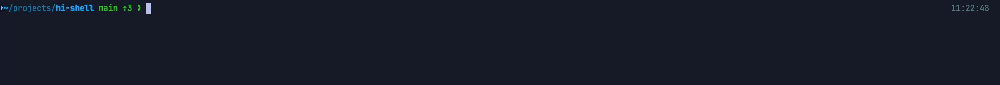

<h1 align="center">hi-shell</h1>

<p align="center">
  
</p>

<p align="center">
  Forgot the command? Say hi.
</p>



`hi-shell` is for the moment you know what you want to do but can't recall the command. It's a small Go binary wired into zsh's ZLE widgets, so you can get a suggestion without leaving your prompt.

Type `hi` and describe what you need. It asks your configured LLM for a command and shows the suggestion as ghost text. Tab puts it on the editable command line; Enter runs it when you're ready.

Use `hi?` to ask about a suggestion or `hi:` to revise it. Local risk scoring warns about risky commands and blocks clearly catastrophic ones.

## 🚀 Install

```sh
curl -fsSL https://raw.githubusercontent.com/longyijdos/hi-shell/main/scripts/install.sh | sh
exec zsh
```

Make sure `~/.local/bin` is in your `PATH`.

From source:

```sh
git clone https://github.com/longyijdos/hi-shell.git
cd hi-shell
./scripts/install.sh
exec zsh
```

Prerequisites for source installs: Go 1.22+, git, and zsh.

## ⚙️ Configure

OpenAI is the default provider:

```sh
export OPENAI_API_KEY="sk-..."

hi-shell config set provider openai
hi-shell config set openai.api_key_env OPENAI_API_KEY
hi-shell config set openai.model gpt-4.1-mini
```

DeepSeek is also supported:

```sh
export DEEPSEEK_API_KEY="sk-..."

hi-shell config set provider deepseek
hi-shell config set deepseek.api_key_env DEEPSEEK_API_KEY
hi-shell config set deepseek.model deepseek-flash
hi-shell config set deepseek.thinking disabled
```

Claude is supported with its native Messages API:

```sh
export ANTHROPIC_API_KEY="sk-ant-..."

hi-shell config set provider claude
hi-shell config set claude.api_key_env ANTHROPIC_API_KEY
hi-shell config set claude.model claude-haiku-4-5
hi-shell config set claude.thinking disabled
```

Secrets stay in environment variables. The config file stores environment variable names, not API keys.

See [Configuration](docs/configuration.md) for the full config reference.

## 🧭 Use

Type a natural-language request with the `hi` prefix:

```zsh
hi list go files
```

Press Enter to generate a suggestion. If the command looks right, press Tab to accept it into your shell input line. Press Enter again to run it.

While a suggestion is available, type `hi?` followed by a question to ask about it, or `hi:` followed by feedback to revise it. See [Usage](docs/usage.md) for details.

## 🛡️ Safety

`hi-shell` never runs generated commands automatically.

The shell plugin only inserts a suggestion after you accept it. You still review the final command and press Enter yourself. Local risk scoring classifies suggestions as `safe`, `warn`, or `blocked`; clearly catastrophic commands such as `rm -rf /` are blocked by default.

See [Risk Scoring](docs/risk-scoring.md) for the detailed model.

## 📚 Documentation

- [Configuration](docs/configuration.md)
- [Usage and CLI](docs/usage.md)
- [Risk Scoring](docs/risk-scoring.md)
- [Development and Release](docs/development.md)

## 🧹 Uninstall

```sh
hi-shell uninstall
exec zsh
```

To remove all hi-shell files, including config:

```sh
hi-shell uninstall --purge
exec zsh
```

## 📄 License

MIT
